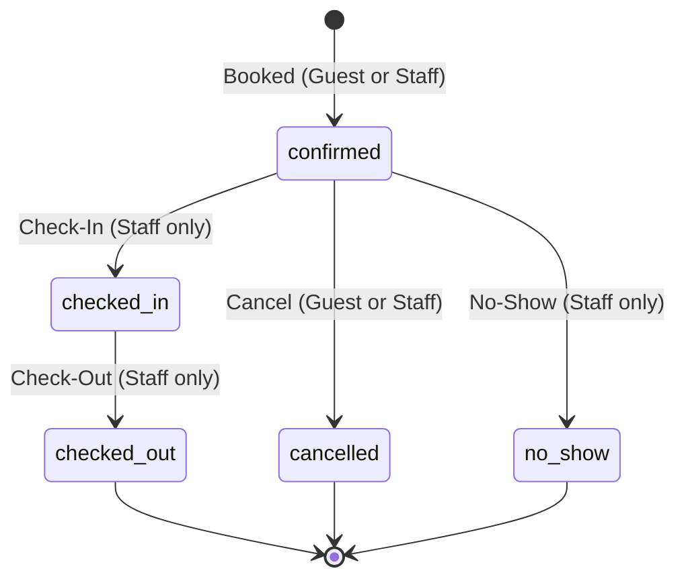

# Stage 1: Database Constraints & Analysis

This document contains the constraint inventory, HTTP status code mappings, and analysis of the existing database schema for the **Kaveri Stays** Hotel Management System.

---

## 1.1 & 1.2 Constraint Inventory & HTTP Status Mapping

The following table lists every database constraint, the business rule it serves, the SQLSTATE it raises when violated (verified by triggering them deliberately), and the decided HTTP status code.

| Table | Constraint Name | Constraint Type | Business Rule / Constraint Description | SQLSTATE | Decided HTTP Status |
| :--- | :--- | :--- | :--- | :--- | :--- |
| **guest** | `guest_pkey` | `PRIMARY KEY` | Unique ID identifier for each guest. | `23505` | `409 Conflict` |
| **guest** | `guest_email_key` / `unique_guest_email` | `UNIQUE` | **Rule 1:** Guest email addresses must be unique. No two guests can register with the same email. | `23505` | `409 Conflict` |
| **property** | `property_pkey` | `PRIMARY KEY` | Unique ID identifier for each property. | `23505` | `409 Conflict` |
| **property** | `property_stars_check` | `CHECK` | Property star rating must be between 1 and 5. | `23514` | `422 Unprocessable` |
| **room_type** | `room_type_pkey` | `PRIMARY KEY` | Unique ID identifier for each room type. | `23505` | `409 Conflict` |
| **room_type** | `room_type_max_occupancy_check` | `CHECK` | Room type maximum occupancy must be strictly greater than 0. | `23514` | `422 Unprocessable` |
| **room_type** | `room_type_type_name_key` | `UNIQUE` | Room type name must be unique. | `23505` | `409 Conflict` |
| **room** | `room_pkey` | `PRIMARY KEY` | Unique ID identifier for each room. | `23505` | `409 Conflict` |
| **room** | `room_property_id_room_number_key` / `unique_room_per_property` | `UNIQUE` | **Rule 2:** Room numbers must be unique within a single property. | `23505` | `409 Conflict` |
| **room** | `room_property_id_fkey` | `FOREIGN KEY` | Room must belong to a valid existing property. | `23503` | `404 Not Found` |
| **room** | `room_room_type_id_fkey` | `FOREIGN KEY` | Room must map to a valid existing room type. | `23503` | `404 Not Found` |
| **rate** | `rate_pkey` | `PRIMARY KEY` | Unique ID identifier for each rate plan. | `23505` | `409 Conflict` |
| **rate** | `rate_property_id_fkey` | `FOREIGN KEY` | Rate must belong to a valid existing property. | `23503` | `404 Not Found` |
| **rate** | `rate_room_type_id_fkey` | `FOREIGN KEY` | Rate must map to a valid existing room type. | `23503` | `404 Not Found` |
| **rate** | `no_overlapping_rates` | `EXCLUSION` | No overlapping rate plans allowed for the same room type at the same property. | `23P01` | `409 Conflict` |
| **booking** | `booking_pkey` | `PRIMARY KEY` | Unique ID identifier for each booking. | `23505` | `409 Conflict` |
| **booking** | `booking_guest_id_fkey` | `FOREIGN KEY` | Booking must map to an existing guest. | `23503` | `404 Not Found` |
| **booking** | `booking_room_id_fkey` | `FOREIGN KEY` | Booking must map to an existing room. | `23503` | `404 Not Found` |
| **booking** | `booking_guest_count_check` | `CHECK` | Booking must have a guest count strictly greater than 0. | `23514` | `422 Unprocessable` |
| **booking** | `no_overlapping_bookings` | `EXCLUSION` | **Rule 6:** Prevents room double-bookings. Dates use a half-open range `[check_in, check_out)`. Ignore cancelled/no-show. | `23P01` | `409 Conflict` |
| **booking** | `enforce_guest_capacity` | `TRIGGER` | **Rule 3:** Guests count must not exceed the room type's maximum occupancy. | `P0001` | `422 Unprocessable` |
| **payment** | `payment_pkey` | `PRIMARY KEY` | Unique ID identifier for each payment. | `23505` | `409 Conflict` |
| **payment** | `payment_booking_id_fkey` | `FOREIGN KEY` | Payment must reference a valid booking. | `23503` | `404 Not Found` |
| **review** | `review_pkey` | `PRIMARY KEY` | Unique ID identifier for each review. | `23505` | `409 Conflict` |
| **review** | `review_booking_id_key` / `one_review_per_booking` | `UNIQUE` | **Rule 9:** Only one review allowed per booking. | `23505` | `409 Conflict` |
| **review** | `review_booking_id_fkey` | `FOREIGN KEY` | Review must map to a valid booking. | `23503` | `404 Not Found` |
| **review** | `review_rating_check` / `valid_rating` | `CHECK` | Review rating must be between 1 and 5. | `23514` | `422 Unprocessable` |

### Summary of Decided HTTP Status Codes
We mapped the exceptions to **3 distinct HTTP status codes**:
1. **`404 Not Found`**: Returned on `23503` (Foreign Key violations). This indicates the requested dependent entity (guest, room, booking, etc.) does not exist in the database.
2. **`409 Conflict`**: Returned on `23505` (Unique Violations) and `23P01` (Exclusion Violations). This indicates a state conflict (duplicate email, double-booking, duplicate review).
3. **`422 Unprocessable Content`**: Returned on `23514` (Check constraints) and `P0001` (Custom trigger exceptions). This indicates syntactically correct inputs that violate logical business domains (guest count > max occupancy, stars outside 1-5 range, etc.).

---

## 1.3 Conflict vs. Bad Request (409 vs. 400)

### The Three State-Conflict Constraints
1. **`guest_email_key` / `unique_guest_email`** (Unique constraint on `guest.email`)
2. **`no_overlapping_bookings`** (Exclusion constraint on `booking.room_id` and dates)
3. **`review_booking_id_key` / `one_review_per_booking`** (Unique constraint on `review.booking_id`)

### Why `400 Bad Request` is the Wrong Choice
- A `400 Bad Request` status indicates that the request was syntactically malformed, had bad syntax, or was missing required elements. The server cannot parse it.
- In contrast, requests triggering these three constraints are **perfectly well-formed**. The JSON payload is correct, the format of fields is valid, and the values are sensible in isolation (e.g., a valid email address string, valid dates, a valid booking ID).
- The transaction fails solely because of the **current state of the system** (e.g., another row already contains the email address, the room is occupied for those dates, or the booking already has a review).
- Per RFC 9110, `409 Conflict` is the correct HTTP status code for resource state conflicts. It tells the client: *"I understood your request and it is formatted correctly, but it conflicts with the current state of the database. You need to resolve this conflict (e.g., pick a different date or register with a different email) before trying again."*

---

## 1.4 Handling Exclusion Constraint Detail Leaks

### Raw PostgreSQL Error Detail
```text
conflicting key value violates exclusion constraint "no_overlapping_bookings"
DETAIL: Key (room_id, daterange(check_in, check_out, '[)'::text))=(1, [2025-01-13,2025-01-14)) conflicts with existing key (room_id, daterange(check_in, check_out, '[)'::text))=(1, [2025-01-12,2025-01-15)).
```

### Decided Client Response (Safe Envelope)
```json
{
  "error": {
    "code": "room_unavailable",
    "message": "That room is not available for the requested dates."
  }
}
```

### Rationale
Exposing the raw `DETAIL` text to the client leaks sensitive operational information:
1. **Database Schema Details:** It directly leaks internal column names (`room_id`, `check_in`, `check_out`), table structures, and constraint names (`no_overlapping_bookings`).
2. **Privacy / PII Leakage:** Most critically, it leaks the **exact dates that another guest has booked** (`[2025-01-12, 2025-01-15)`). A malicious user could probe rooms to scrape other guests' travel dates, violating user privacy.

---

## 1.5 Surviving the API (Rule 3)

The capacity check rule is: *Guest count in a booking must not exceed the room type's maximum occupancy.*

This check is implemented as a PostgreSQL database trigger (`enforce_guest_capacity`) executing the PL/pgSQL function `check_guest_capacity()` BEFORE INSERT OR UPDATE on `booking`.
- Because this constraint is implemented as a **database-level trigger**, it executes directly inside the PostgreSQL transaction space on every write statement.
- **It will survive any INSERT coming from the API.** Even if someone bypasses Pydantic/FastAPI validation or uses raw SQL/Django ORM, the database will raise an exception (`SQLSTATE P0001`) and roll back the transaction.

---

## 1.6 Unconstrainable Rules in DDL

### The Unconstrainable Rule
*A booking cannot be backdated (i.e. check_in date must be greater than or equal to the current date).*

### Why DDL Cannot Enforce It
In PostgreSQL, `CHECK` constraints must be deterministic (immutable). They cannot reference non-immutable functions such as `CURRENT_DATE`, `NOW()`, or `LOCALTIMESTAMP` because the value of these functions changes over time. If you write `CHECK (check_in >= CURRENT_DATE)`, PostgreSQL will reject it at table creation time:
`ERROR: pg_check_constraint: cannot use non-immutable function in check constraint`

### Where It Will Live
This rule will live in the **API layer**:
- Inside **Pydantic validators** (specifically a `@field_validator` on the request model checking that the `check_in` date is `>= date.today()`).
- Inside the **Service layer** before executing database inserts.

### Bypassing the API (psql)
If someone bypasses the API and inserts directly via `psql`, **the check is bypassed completely**. The database has no mechanism to block the insert, and historical or backdated bookings can be successfully written.

---

## 1.7 Dangerous Stage 4 Queries

Three types of queries from Stage 4 are dangerous to expose directly as API endpoints:

1. **Queries Returning Unbounded Result Sets:** E.g., returning all bookings across all properties or all guest records without `limit` and `offset` pagination. If the database grows to thousands of records, querying this on a single request causes memory issues, slow response times, and potential database locking.
2. **Queries Causing Full-Table Scans on Every Request:** Queries searching for guests by prefix/substring without indexes, or calculating guest stays across large tables. 
3. **Cross-Property Aggregations:** E.g., the total revenue and occupancy reports across all properties. Exposing these directly to property managers violates authorization rules (BOLA). A manager should only see reports scoped to their own property (`property_id`). Only the `owner` is authorized to see cross-property numbers.

---

## 1.8 Columns a Guest May Never See

Guests should only see their own records, and should never see the following columns:
1. **`guest.phone` / `guest.city` / `guest.email` / `guest.name` of other guests:** Personal Identifiable Information (PII) of other customers must be kept secret.
2. **`account.password_hash` (Stage 2):** Password hashes must never be serialized or returned in any GET response (e.g. `/me` or `/guests`).
3. **`booking.guest_id` of other bookings:** Guests should only view bookings matching their own `guest_id`.

---

## 1.9 Booking State Machine (Rule 7)

The booking lifecycle has five states: `confirmed`, `checked_in`, `checked_out`, `cancelled`, and `no_show`.

### Mermaid State Diagram


### Authorization Matrix for Transitions
- **`confirmed` -> `checked_in`**: Staff, Manager, Owner (when the guest arrives at the property).
- **`confirmed` -> `cancelled`**: Guest (for their own booking), Staff, Manager, Owner.
- **`confirmed` -> `no_show`**: Staff, Manager, Owner (if the guest fails to arrive).
- **`checked_in` -> `checked_out`**: Staff, Manager, Owner (when the guest departs).

*Note: Transitioning directly from `confirmed` to `checked_out` is illegal. You cannot cancel a stay that a guest has already checked into (`checked_in` -> `cancelled` is illegal).*

---

## 1.10 Recommended Schema Schema Changes

### Recommended Change
**Add a `total_amount` column (NUMERIC) directly to the `booking` table.**

### Rationale
- **Historical Integrity:** Currently, the booking cost is derived at query time by joining the `rate` table. If room rates change in the future, the cost of past bookings will change retrospectively, which is a critical bug. Storing the total amount at the moment of booking freezes the transaction price.
- **Performance:** Calculating rates dynamically involves generating a date series, matching dates to overlapping rate periods, and summing the rates. Doing this on every listing or check-out query is highly inefficient. Storing `total_amount` simplifies calculating the outstanding `balance` (`total_amount - sum(payments)`).
